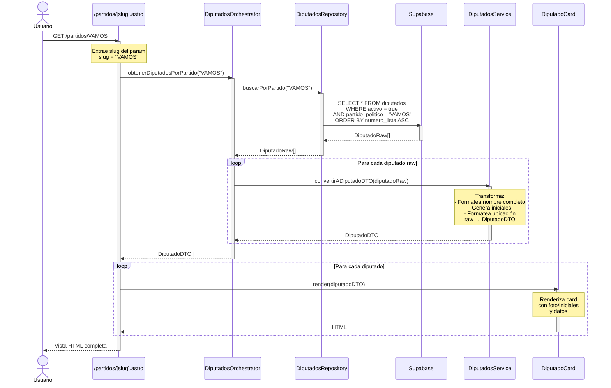

# Caso de Uso: Listado de Diputados por Partido

## Descripción
Usuario accede a `/partidos/[slug]` (ej: `/partidos/VAMOS`) y visualiza el listado de diputados de ese partido específico, con sus datos completos.

## Diagrama de Secuencia



## Responsabilidades por Archivo

### `/src/pages/partidos/[slug].astro`
**Responsabilidad**: Orquestar obtención y renderizado de diputados por partido
- Implementa `getStaticPaths()` para generar rutas estáticas
- Extrae `slug` de `Astro.params`
- Decodifica slug: `decodeURIComponent(slug)`
- Importa `DiputadosOrchestrator`
- Llama a `orchestrator.obtenerDiputadosPorPartido(nombrePartido)`
- Pasa DTOs a `DiputadoCard`
- Renderiza layout y grid
- **NO** hace queries directas
- **NO** transforma datos

### `/src/pages/partidos/[slug].astro` - `getStaticPaths()`
**Responsabilidad**: Generar rutas estáticas para cada partido
- Usa `PartidosOrchestrator.obtenerNombresPartidos()`
- Retorna array de `{ params: { slug: string } }`
- Encode nombres para URLs
- **NO** hace queries directas

### `/src/orchestrators/diputados.orchestrator.ts`
**Responsabilidad**: Coordinar flujo completo de diputados
- Método: `obtenerDiputadosPorPartido(partido: string): Promise<DiputadoDTO[]>`
- Llama a `DiputadosRepository.buscarPorPartido(partido)`
- Itera datos raw
- Inyecta cada raw en `DiputadosService.convertirADiputadoDTO()`
- Maneja errores
- Retorna array de DTOs
- **NO** hace queries
- **NO** transforma directamente

### `/src/orchestrators/partidos.orchestrator.ts`
**Responsabilidad**: Proveer lista de nombres de partidos para rutas estáticas
- Método: `obtenerNombresPartidos(): Promise<string[]>`
- Llama a `PartidosRepository.obtenerPartidosActivos()`
- Extrae nombres únicos de partidos
- Retorna array de strings
- Usado por `getStaticPaths()`

### `/src/repositories/diputados.repository.ts`
**Responsabilidad**: Queries de diputados en Supabase
- Método: `buscarPorPartido(partido: string): Promise<DiputadoRaw[]>`
- Query: 
  ```sql
  SELECT * FROM diputados 
  WHERE activo = true 
  AND partido_politico = $1
  ORDER BY numero_lista ASC
  ```
- Retorna datos raw sin transformar
- **NO** tiene lógica de negocio
- **NO** formatea datos

### `/src/services/diputados.service.ts`
**Responsabilidad**: Transformar diputados raw a DTOs
- Método: `convertirADiputadoDTO(raw: DiputadoRaw): DiputadoDTO`
- Formatea nombre completo
- Genera iniciales para avatar
- Formatea ubicación (distrito + departamento)
- Valida campos requeridos
- Transforma estructura de datos
- **NO** hace queries
- **NO** importa repositories

### `/src/dtos/diputado.dto.ts`
**Responsabilidad**: Definir estructura del Diputado para UI
```typescript
export interface DiputadoDTO {
  id: string;
  nombreCompleto: string;
  iniciales: string;
  partido: string;
  ubicacion: string;
  numeroLista: number;
  fotoUrl?: string;
  email?: string;
  telefono?: string;
}
```

### `/src/components/DiputadoCard/DiputadoCard.astro`
**Responsabilidad**: Renderizar UI de un diputado
- Recibe `DiputadoDTO` como prop
- Renderiza avatar (foto o iniciales)
- Muestra nombre completo, partido, ubicación
- Muestra número de lista
- Tailwind inline para estilos
- **NO** tiene lógica
- **NO** transforma datos
- **NO** accede a DB

### `/src/components/DiputadoCard/DiputadoCard.types.ts`
**Responsabilidad**: Definir props del componente
```typescript
export interface DiputadoCardProps {
  diputado: DiputadoDTO;
}
```

## Flujo de Datos

```
Usuario → Page [slug]
          ↓ (extrae slug)
       Orchestrator ← (obtenerDiputadosPorPartido)
          ↓
       Repository → Supabase (query WHERE partido)
          ↓ (DiputadoRaw[])
       Orchestrator ← (itera raw data)
          ↓ (inyecta cada raw)
       Service → (convierte raw → DTO)
          ↓ (DiputadoDTO)
       Orchestrator ← (acumula DTOs)
          ↓ (DiputadoDTO[])
       Page ← (recibe array DTOs)
          ↓ (loop)
       Component → (renderiza cada uno)
          ↓
       Usuario (ve grid de cards)
```

## Flujo Secundario: getStaticPaths()

```
Build Time → getStaticPaths()
               ↓
          PartidosOrchestrator.obtenerNombresPartidos()
               ↓
          PartidosRepository.obtenerPartidosActivos()
               ↓
          Supabase (SELECT DISTINCT partido_politico)
               ↓
          ["VAMOS", "UNE", "SEMILLA", ...]
               ↓
          [{ params: { slug: "VAMOS" }}, ...]
               ↓
          Astro genera rutas estáticas
```

## Reglas de Este Flujo

1. **getStaticPaths usa Orchestrator** - No queries directas
2. **Page extrae slug y llama Orchestrator** - No lógica
3. **Orchestrator itera e inyecta en Service** - No transforma
4. **Repository query con WHERE** - Filtra por partido
5. **Service convierte uno a uno** - Sin queries
6. **Component solo renderiza DTO** - Sin transformaciones

## Archivos Involucrados

- ✅ `/src/pages/partidos/[slug].astro`
- ✅ `/src/orchestrators/diputados.orchestrator.ts`
- ✅ `/src/orchestrators/partidos.orchestrator.ts` (para getStaticPaths)
- ✅ `/src/repositories/diputados.repository.ts`
- ✅ `/src/repositories/partidos.repository.ts` (para getStaticPaths)
- ✅ `/src/services/diputados.service.ts`
- ✅ `/src/dtos/diputado.dto.ts`
- ✅ `/src/components/DiputadoCard/DiputadoCard.astro`
- ✅ `/src/components/DiputadoCard/DiputadoCard.types.ts`

## Relación con Otros Casos de Uso

- **Depende de**: `listado-partidos` (para getStaticPaths)
- **Usado por**: Navegación desde cards de partidos
