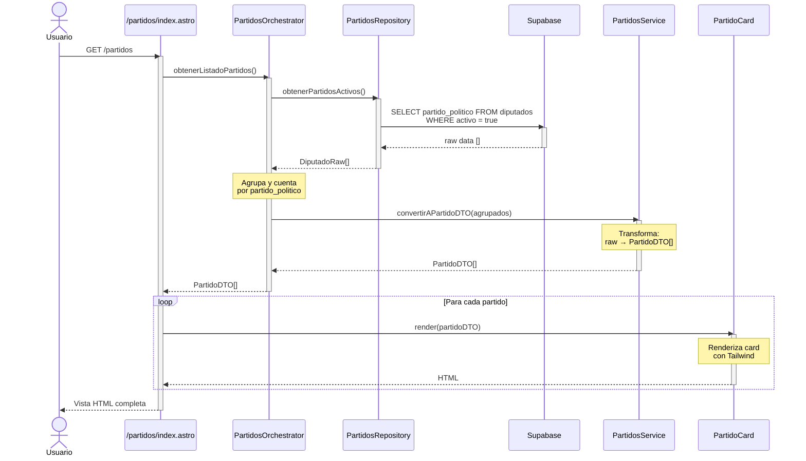

# Caso de Uso: Listado de Partidos

## Descripción
Usuario accede a `/partidos` y visualiza un listado de todos los partidos políticos representados en el Congreso, mostrando el nombre del partido y la cantidad de diputados.

## Diagrama de Secuencia



## Responsabilidades por Archivo

### `/src/pages/partidos/index.astro`
**Responsabilidad**: Orquestar la obtención de datos y renderizado
- Importar `PartidosOrchestrator`
- Llamar a `orchestrator.obtenerListadoPartidos()`
- Pasar DTOs a componentes
- Renderizar layout y grid de cards
- **NO** contiene lógica de DB
- **NO** transforma datos

### `/src/orchestrators/partidos.orchestrator.ts`
**Responsabilidad**: Coordinar el flujo completo del caso de uso
- Método: `obtenerListadoPartidos(): Promise<PartidoDTO[]>`
- Llama a `PartidosRepository.obtenerPartidosActivos()`
- Agrupa datos por `partido_politico`
- Cuenta cantidad de diputados por partido
- Inyecta datos agrupados en `PartidosService.convertirAPartidoDTO()`
- Maneja errores y retorna DTOs
- **NO** hace queries directas a DB
- **NO** transforma datos (delega a service)

### `/src/repositories/partidos.repository.ts`
**Responsabilidad**: Acceso a datos de partidos desde Supabase
- Método: `obtenerPartidosActivos(): Promise<DiputadoRaw[]>`
- Query: `SELECT partido_politico FROM diputados WHERE activo = true`
- Retorna datos raw sin transformar
- **NO** tiene lógica de negocio
- **NO** agrupa ni cuenta

### `/src/services/partidos.service.ts`
**Responsabilidad**: Transformar datos raw a DTOs
- Método: `convertirAPartidoDTO(agrupados: Map<string, number>): PartidoDTO[]`
- Recibe datos ya agrupados por orchestrator
- Convierte Map → Array de PartidoDTO
- Ordena por cantidad de diputados (desc)
- Valida que nombres no estén vacíos
- **NO** hace queries a DB
- **NO** importa repositories

### `/src/dtos/partido.dto.ts`
**Responsabilidad**: Definir estructura de datos del Partido
```typescript
export interface PartidoDTO {
  nombre: string;
  slug: string;
  totalDiputados: number;
  colorGradient: string;
}
```

### `/src/components/PartidoCard/PartidoCard.astro`
**Responsabilidad**: Renderizar UI de un partido
- Recibe `PartidoDTO` como prop
- Renderiza card con Tailwind inline
- Muestra nombre, total de diputados, link
- **NO** tiene lógica
- **NO** transforma datos

## Flujo de Datos

```
Usuario → Page
          ↓
       Orchestrator ← (coordina)
          ↓
       Repository → Supabase (query)
          ↓ (raw data)
       Orchestrator ← (agrupa/cuenta)
          ↓ (inyecta agrupados)
       Service → (convierte a DTO)
          ↓ (PartidoDTO[])
       Page ← (recibe DTOs)
          ↓
       Component → (renderiza)
          ↓
       Usuario (ve HTML)
```

## Reglas de Este Flujo

1. **Page NO hace queries** - Solo orquesta
2. **Orchestrator coordina** - Usa repo + service
3. **Repository solo queries** - Sin transformaciones
4. **Service solo transforma** - Sin queries
5. **Component solo renderiza** - Sin lógica

## Archivos Involucrados

- ✅ `/src/pages/partidos/index.astro`
- ✅ `/src/orchestrators/partidos.orchestrator.ts`
- ✅ `/src/repositories/partidos.repository.ts`
- ✅ `/src/services/partidos.service.ts`
- ✅ `/src/dtos/partido.dto.ts`
- ✅ `/src/components/PartidoCard/PartidoCard.astro`
- ✅ `/src/components/PartidoCard/PartidoCard.types.ts`
