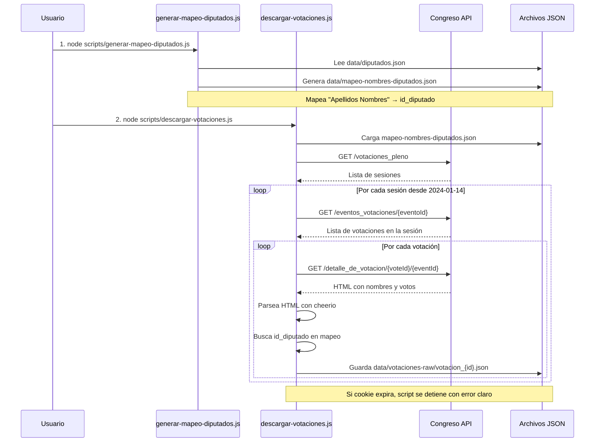
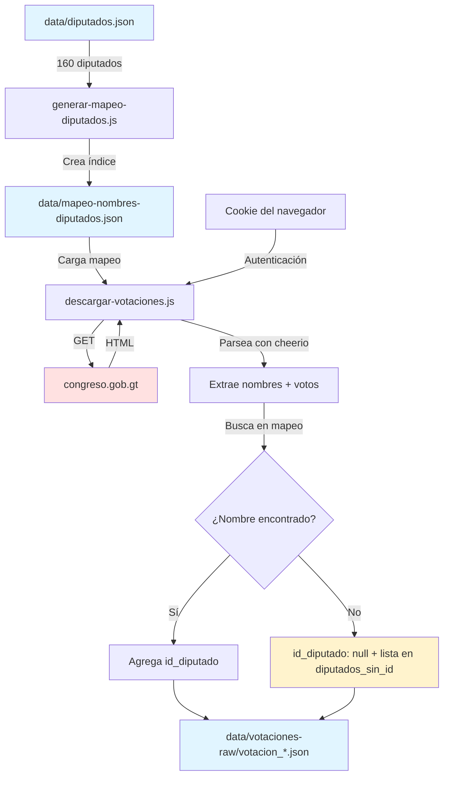
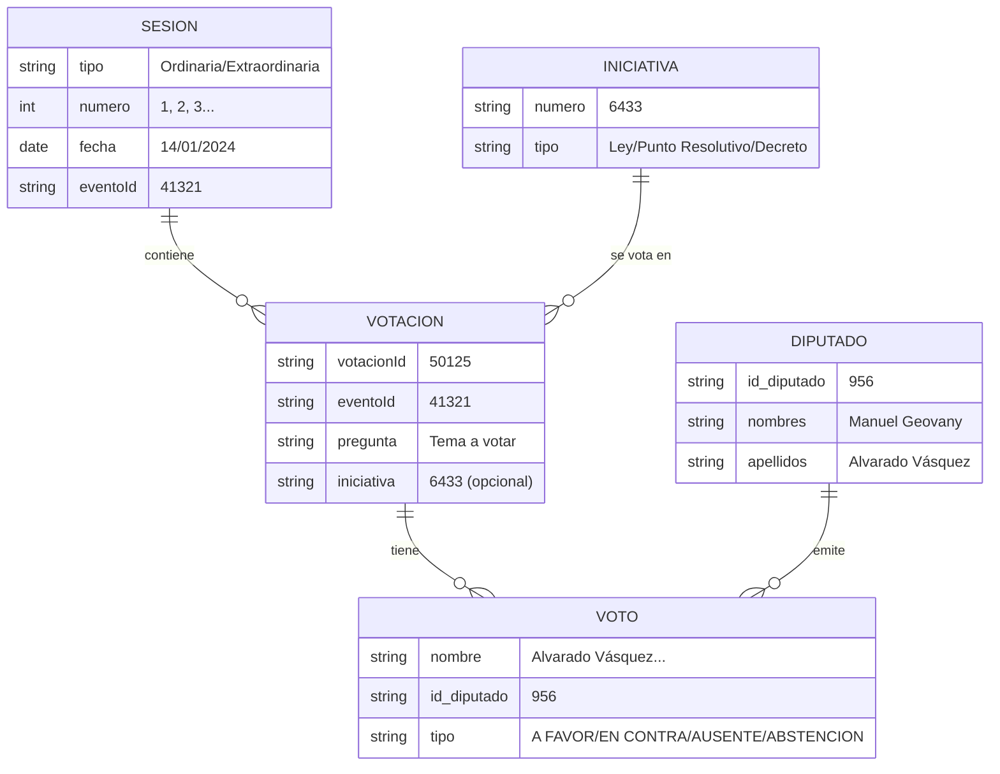

# Flujo de Scripts - Sistema de Votaciones del Congreso

## Diagrama de Secuencia General



## Flujo de Datos



## Scripts y su Propósito

### 1. `generar-mapeo-diputados.js`
**Propósito**: Crear índice de nombres → IDs

**Input**: 
- `data/diputados.json` (160 diputados con id_diputado del Congreso)

**Proceso**:
```javascript
// Por cada diputado:
nombreCompleto = `${apellidos} ${nombres}`.trim()
// Ejemplo: "Alvarado Vásquez Manuel Geovany"

mapeo[nombreCompleto] = id_diputado
// Ejemplo: mapeo["Alvarado Vásquez Manuel Geovany"] = "956"
```

**Output**:
- `data/mapeo-nombres-diputados.json`
```json
{
  "generado": "2025-12-08T...",
  "total": 160,
  "duplicados": 0,
  "mapeo": {
    "Alvarado Vásquez Manuel Geovany": "956",
    "Archila Cordón Manuel de Jesús": "907",
    ...
  },
  "conflictos": {}
}
```

**Cuándo ejecutar**: 
- Una vez, o cuando se actualice `data/diputados.json`
- Si hay nuevos diputados en el Congreso

---

### 2. `descargar-votaciones.js`
**Propósito**: Descargar TODAS las votaciones desde inicio del mandato

**Input**:
- Cookie fresca del navegador (línea 18)
- `data/mapeo-nombres-diputados.json`

**Proceso**:
1. **Obtener sesiones** (`obtenerSesiones()`)
   - GET `/votaciones_pleno`
   - Filtra sesiones con fecha >= "14/01/2024"
   - Extrae: tipo, numero, fecha, eventoId

2. **Por cada sesión** (`obtenerVotacionesDeSesion(eventoId)`)
   - GET `/eventos_votaciones/{eventoId}`
   - Extrae IDs de votaciones de la sesión
   - Regex: `/detalle_de_votacion\/(\d+)\/\d+/g`

3. **Por cada votación** (`descargarVotacion(voteId, eventId, sesion)`)
   - GET `/detalle_de_votacion/{voteId}/{eventId}`
   - Parsea HTML con cheerio
   - Extrae:
     * Pregunta (tema votado)
     * Iniciativa # (si menciona "INICIATIVA \d+")
     * Votos por diputado:
       - Busca en tabla `#asesores_detalle tr`
       - Por cada fila: nombre + badge de voto
       - Busca `id_diputado` en mapeo
       - Guarda: `{nombre, id_diputado}`

4. **Detección de problemas**:
   - Si respuesta < 2000 bytes → Cookie expirada → ERROR y detiene
   - Si diputado no en mapeo → `id_diputado: null` + agrega a `diputados_sin_id[]`

**Output**: `data/votaciones-raw/votacion_{id}.json`
```json
{
  "votacionId": "50125",
  "eventoId": "41321",
  "sesion": {
    "tipo": "Ordinaria",
    "numero": "1",
    "fecha": "14/01/2024"
  },
  "pregunta": "APROBACIÓN DEL ORDEN DEL DÍA",
  "iniciativa": null,
  "votos": {
    "favor": [
      {"nombre": "Alvarado Vásquez Manuel Geovany", "id_diputado": "956"},
      {"nombre": "Archila Cordón Manuel de Jesús", "id_diputado": "907"}
    ],
    "contra": [],
    "ausente": [...],
    "abstencion": []
  },
  "totales": {
    "favor": 31,
    "contra": 0,
    "ausente": 61,
    "abstencion": 0
  },
  "diputados_sin_id": [
    "Galindo de León José Luis",
    "Pellecer Rodriguez  Rodrigo Antonio"
  ]
}
```

**Validaciones**:
- ✅ Cookie válida (respuesta > 2000 bytes)
- ⚠️ Diputados sin ID (muestra warning en consola)
- 🛑 Cookie expirada → ERROR con instrucciones para renovar

**Cuándo ejecutar**:
- Primera vez: descarga TODAS las votaciones desde 2024-01-14
- Luego: periódicamente para obtener nuevas votaciones
- Si archivos ya existen, los salta (no reemplaza)

---

### 3. `test-una-sesion.js`
**Propósito**: Probar con UNA sesión antes de correr el script completo

**Input**:
- Cookie fresca (hardcoded)
- EventoId fijo: 41321

**Comportamiento**: Igual que `descargar-votaciones.js` pero solo una sesión

**Output**: `data/votaciones-test/votacion_*.json`

**Cuándo usar**:
- Para verificar que cookie funciona
- Para probar cambios en parsing sin esperar horas
- Para validar estructura de datos

---

### 4. `test-votacion.js`
**Propósito**: Probar con UNA SOLA votación específica

**Input**:
- Cookie fresca
- URL fija: `/detalle_de_votacion/50125/41321`

**Output**: 
- `test-votacion-50125.json`
- Imprime en consola resumen de votos

**Cuándo usar**:
- Debug rápido de parsing
- Verificar que cookie funciona (< 1 segundo)

---

## Estructura de Datos del Congreso

### Endpoints

```mermaid
graph LR
    A[/votaciones_pleno] -->|Lista sesiones| B[/eventos_votaciones/41321]
    B -->|Lista votaciones| C[/detalle_de_votacion/50125/41321]
    C -->|Votos individuales| D[HTML con tabla]
    
    style A fill:#d4edff
    style B fill:#d4edff
    style C fill:#d4edff
    style D fill:#fff9db
```

### Relación de Entidades



---

## Cookies y Autenticación

### ¿Por qué necesitamos cookies?

El sitio del Congreso usa **Incapsula/Imperva WAF** para protección contra bots.

### Estructura de cookie requerida:
```
nlbi_1649317=...
incap_ses_1409_1649317=...
incap_ses_1606_1649317=...
ci_sessions=...  ← MÁS IMPORTANTE
_gid=...
_ga=...
_ga_5PBQM5BVPH=...
visid_incap_1649317=...
_gat_gtag_UA_90716026_1=...
```

### ¿Cómo obtener cookie fresca?

1. Abrir Chrome/Firefox
2. Ir a: `https://www.congreso.gob.gt/detalle_de_votacion/50125/41321`
3. F12 → Network → Refrescar
4. Click en request → Headers → Cookie
5. Copiar TODO el valor
6. Reemplazar en línea 18 del script

### Síntomas de cookie muerta:
- Respuesta < 2000 bytes (esperado: >100KB)
- Script muestra: `❌❌❌ ERROR CRÍTICO: LA COOKIE EXPIRÓ`
- HTML retornado es solo estructura vacía

---

## Orden de Ejecución

### Primera vez (setup completo):

```bash
# 1. Generar mapeo de nombres → IDs
node scripts/generar-mapeo-diputados.js

# 2. Obtener cookie fresca del navegador
# (Copiar de DevTools y pegar en línea 18)

# 3. OPCIONAL: Probar con una votación
node scripts/test-votacion.js

# 4. OPCIONAL: Probar con una sesión
node scripts/test-una-sesion.js

# 5. Descargar TODAS las votaciones
node scripts/descargar-votaciones.js
```

### Actualizaciones periódicas:

```bash
# 1. Renovar cookie si expiró
# 2. Correr descarga (salta archivos existentes)
node scripts/descargar-votaciones.js
```

---

## Problemas Comunes y Soluciones

### ❌ Cookie expiró durante ejecución
**Síntoma**: Script se detiene después de X votaciones
**Solución**: 
1. Obtener cookie fresca
2. Re-ejecutar script (salta archivos ya descargados)

### ⚠️ Diputados sin ID
**Síntoma**: Campo `diputados_sin_id` no vacío
**Posibles causas**:
- Espacios extras en nombre
- Diferencia en acentos/tildes
- Diputado nuevo no en `data/diputados.json`

**Solución**: 
1. Ver lista en JSON
2. Comparar con `data/diputados.json`
3. Actualizar mapeo o normalizar nombres

### 🐌 Script muy lento
**Causa**: Delay de 500ms entre requests (para no saturar servidor)
**Cálculo**: ~2 votaciones/segundo = ~120 votaciones/minuto

### 📦 Response muy grande (>50MB)
**Solución**: Ya configurado `maxBuffer: 50MB` en execAsync

---

## Archivos Importantes

```
voto-diputados-gt/
├── data/
│   ├── diputados.json                    # Fuente: 160 diputados del Congreso
│   ├── mapeo-nombres-diputados.json      # Generado por script 1
│   ├── votaciones-raw/                   # Output principal
│   │   ├── votacion_46931.json
│   │   ├── votacion_46932.json
│   │   └── ... (cientos de archivos)
│   └── votaciones-test/                  # Output de pruebas
│
├── scripts/
│   ├── generar-mapeo-diputados.js        # Script 1: Setup
│   ├── descargar-votaciones.js           # Script 2: Main
│   ├── test-una-sesion.js                # Script 3: Testing
│   └── test-votacion.js                  # Script 4: Debug
│
└── .fcoder/memories/
    └── scripts-votaciones-flujo.md       # Esta documentación
```

---

## Próximos Pasos

1. ✅ Scripts funcionando
2. ✅ Mapeo de IDs implementado
3. ⏳ Investigar diputados sin ID
4. ⏳ Correr descarga completa
5. ⏳ Importar a Supabase
6. ⏳ Crear queries para relacionar diputado → votos → iniciativas
